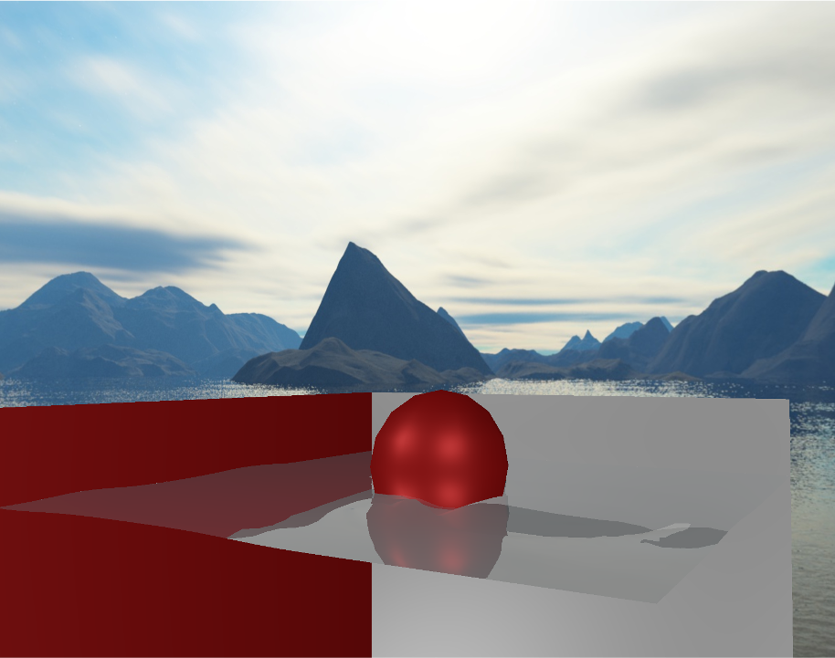

In this OpenGL Engine I implemented the following techniques : 

- Height Field Water from Matthias Müller
- Ray-Traced reflection and refraction
- PBR Shading

I tried an implementation of Evan Wallace caustic technique but it is not complete, there also are several techniques implemented in : https://github.com/CieuFr/OpenGl_Engine

You can also find a short demo here : https://youtu.be/vgzinmb2enY

The architecture of this project is based on https://github.com/TheCherno/ProjectTemplate

  

